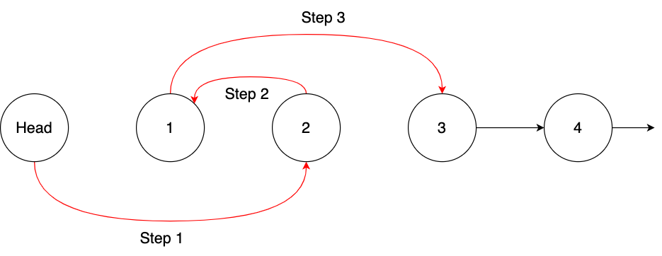

# 24. Swap Nodes in Pairs

###### tags: `Linked-List`
<br>

[LeetCode](https://leetcode.com/problems/swap-nodes-in-pairs/)

[參考](https://github.com/youngyangyang04/leetcode-master/blob/master/problems/0024.%E4%B8%A4%E4%B8%A4%E4%BA%A4%E6%8D%A2%E9%93%BE%E8%A1%A8%E4%B8%AD%E7%9A%84%E8%8A%82%E7%82%B9.md)

每兩個節點交換彼此的順序，並回傳頭節點。


**範例 1**
```
Input: head = [1,2,3,4]
Output: [2,1,4,3]
```

**範例 2**
```
Input: head = []
Output: []
```

**範例 3**
```
Input: head = [1]
Output: [1]
```

**限制邊界**
- 0 <= Node.val <= 100

## 思路



**注意**：由於兩個節點一組，迴圈判斷為 `cur->next` & `cur->next->next`
- 頭節點是虛擬節點，實際上第一個節點是 cur->next
- 兩個節點一組，我們可以將範圍先縮小至一組，以利於迴圈判斷
- 若其中一個節點不存在，則無法進行互換

```CPP
struct ListNode {
    int val;
    ListNode *next;
    ListNode() : val(0), next(nullptr) {}
    ListNode(int x) : val(x), next(nullptr) {}
    ListNode(int x, ListNode *next) : val(x), next(next) {}
};

class Solution {
    public:
        ListNode* swapPairs(ListNode* head) {
        ListNode* dummy = new ListNode();
        dummy->next = head;
        ListNode* cur = dummy;

        while (cur->next != NULL && cur->next->next != NULL) {
            ListNode* temp = cur->next;
            ListNode* temp1 = cur->next->next->next;

            cur->next = cur->next->next;
            cur->next->next = temp;
            cur->next->next->next = temp1;

            cur = cur->next->next;
        }

        return dummy->next;
    }
};
```

- 時間複雜度：O(n)
- 空間複雜度：O(1)
